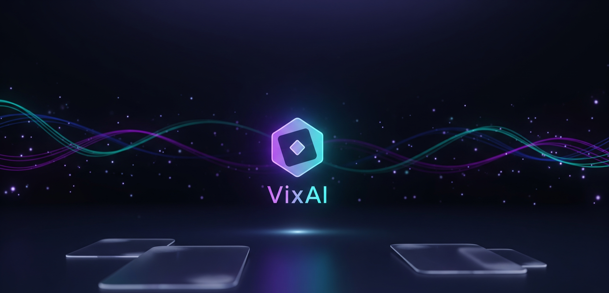

   
 

 
 <h1 align="center">VixAI</h1>
 
<em>Plataforma educativa introductoria sobre Inteligencia Artificial</em>

 
 

   
   
   
 

 
 
 ## Descripción general
 VixAI es una aplicación web estática (HTML + CSS + JavaScript sin frameworks) orientada a enseñar conceptos fundamentales de IA mediante módulos temáticos con contenido teórico, prácticas interactivas y cuestionarios (quizzes). La app incluye registro e inicio de sesión de usuarios, persistencia de progreso local y sincronización opcional con una base de datos en Supabase mediante su API REST (PostgREST).
 
 ## Estructura del repositorio
 - index.html: Documento principal y punto de entrada de la aplicación.
 - styles.css: Estilos globales, diseño responsivo, efectos visuales y componentes UI.
 - app.js: Lógica de negocio y de interfaz (autenticación, módulos, progreso, modales, quizzes, etc.).
 - LOGO/VixAI.png: Logotipo utilizado para identidad visual del proyecto.
 
 ## Visión arquitectónica (alto nivel)
 - Capa de Presentación (HTML/CSS):
   - index.html define la estructura de la página: panel de autenticación, encabezado (hero), grilla de módulos, modal de contenido, indicadores de progreso, ayuda y secciones legales/sociales.
   - styles.css gestiona tema oscuro, efectos de fondo (blobs, grano), componentes con blur, estados interactivos, layout responsivo y accesibilidad visual.
 - Capa de Lógica de Cliente (JavaScript en app.js):
   - Manejo de autenticación manual utilizando tablas personalizadas en Supabase (sin SDK, vía fetch y PostgREST).
   - Gestión de estado de sesión y progreso en localStorage.
   - Renderizado dinámico de módulos, apertura de modales y verificación de quizzes.
   - Feedback visual (confeti), microinteracciones (shake/pulse), y efectos de UI globales.
 - Capa de Persistencia (Remota y Local):
   - Remota: Supabase REST (tablas usuarios y progreso).
   - Local: localStorage para usuario activo y progreso por módulo.

 ## DETALLE DE COMPONENTES Y FLUJOS CLAVE
1) Autenticación y Sesión
   - Variables de entorno en cliente: SUPABASE_URL y SUPABASE_KEY definidas al inicio de app.js.
   - Función sb(path, options): Helper para invocar PostgREST con fetch, arma cabeceras (apikey, Authorization Bearer, Content-Type, Prefer) y maneja errores.
   - Registro (registerHandler):
     - Valida campos y longitud mínima de contraseña.
     - Verifica existencia de email en tabla usuarios.
     - Calcula hash SHA-256 del password en el cliente y envía a Supabase como password_hash.
     - Inserta el usuario intentando diversos valores para el campo origen (app, landing, organic, direct, unknown) para cumplir posibles restricciones CHECK del esquema. Si un valor no pasa la validación (HTTP 400 con mensaje sobre origen/check), prueba el siguiente.
     - Tras crear, recupera la fila creada (id, nombre_completo, email), guarda sesión en localStorage y muestra la UI de usuario logueado.
   - Inicio de sesión (loginHandler):
     - Obtiene email y password, calcula hash SHA-256 en cliente.
     - Consulta en usuarios por email y compara password_hash. Si coincide, persiste sesión y carga progreso.
   - Sesión en cliente:
     - saveSession(u), loadSession(), clearSession(): administran currentUser en localStorage bajo la clave vixai_user.
     - showAvatar() / showAuth(): alternan visibilidad entre panel de autenticación y avatar de usuario.

2) Módulos de Aprendizaje (Contenido, Prácticas y Quiz)
   - Definición estática en app.js mediante el arreglo modules: Lista de 5 módulos (p. ej., “¿Qué es la IA?”, “Datos y modelos”, “Entrenamiento”, “Producción y MLOps”, “Ética en IA”). Cada módulo contiene descripción y preguntas de quiz.
   - Renderizado de la grilla (renderGrid): Genera tarjetas con estado “Completado/Pendiente” según userProgress.
   - Apertura de módulos (openModule): Crea contenido en un modal, con pestañas internas (Contenido, Prácticas, Quiz), y listeners específicos por módulo (handleM1Logic, handleM2Logic, etc.).
   - Validaciones de prácticas y quizzes: Se evalúan en el cliente. Al aprobar el quiz (umbral típico 80%), se invoca markCompleted(id), se cierra el modal, se dispara celebrate() (confeti), y se actualiza la UI de progreso.

3) Progreso del Usuario
   - Estructura local: userProgress (Set en memoria) persistido como arreglo en localStorage bajo la clave vixai_progress.
   - markCompleted(moduleId):
     - Añade el módulo al Set, sincroniza en localStorage.
     - Si hay usuario autenticado, intenta registrar progreso en Supabase (tabla progreso) con { usuario_id, módulo, completado: true }.
   - fetchProgress():
     - Restaura progreso desde localStorage.
     - Si hay usuario autenticado, consulta en Supabase por el usuario y fusiona los módulos con completado = true a userProgress.
   - updateProgressUI():
     - Cálculo simple del avance (completados/5) y animación de barra de progreso.

4) Interfaz de Usuario y Experiencia
   - Autenticación:
     - Panel flotante con pestañas “Registrarse / Iniciar sesión”, minimizable con transición (toggleAuthPanel) y subrayado animado (moveUnderline).
   - Navegación principal:
     - Hero (título, subtítulo, CTA “Explorar módulos”).
     - Indicador de progreso fijo.
     - Grilla de tarjetas de módulos.
   - Modales de contenido:
     - Ventana con scroll, cierre vía botón o click en overlay, y layout para contenido, prácticas y quiz.
   - Avatar y menú contextual:
     - Muestra iniciales a partir de nombre o email (initialsFrom).
     - Menú con acciones: Perfil, Progreso y Cerrar sesión.
   - Ayuda y sección legal/social:
     - Vista de ayuda con FAQs básicas.
     - Créditos y enlaces sociales.
   - Accesibilidad y microinteracciones:
     - Estados hover/focus, tamaños mínimos, animaciones con prefers-reduced-motion.
     - Efectos visuales: blobs, grano, resplandores, confeti (setupConfetti/celebrate).

5) Persistencia y Backend (Supabase)
   - Acceso vía REST: No se usa SDK oficial; todas las operaciones son fetch a PostgREST con helper sb().
   - Tablas esperadas (derivadas del código):
     - usuarios: id, nombre_completo, email, password_hash, seccion, origen.
       • Reglas implícitas: email único; origen sujeto a restricción CHECK (por eso se prueban valores alternativos en el registro).
     - progreso: usuario_id, módulo (nota: el campo se utiliza con acento en consultas: "módulo"), completado (boolean).
   - Seguridad:
     - Se usa SUPABASE_KEY “anon” en el cliente para consultas/insert. Las Reglas RLS deben permitir el patrón de acceso previsto (lectura de usuario por email, escritura de progreso del usuario autenticado, etc.). Se recomienda endurecer RLS y evitar exponer operaciones sensibles.

6) Almacenamiento Local (localStorage)
   - vixai_user: JSON con datos mínimos del usuario autenticado.
   - vixai_progress: Arreglo con IDs de módulos completados.
   - También se utilizan claves específicas por módulo para marcar contenidos como “leídos”.

7) Estilos y Responsividad (styles.css)
   - Tema oscuro, capas de fondo con blobs y grano, gradientes y blur.
   - Componentes:
     • Botones (primary/ghost), badges, tarjetas, modales, tabs internas de módulos, quiz.
     • Panel de autenticación colapsable.
     • Indicador de progreso con barra animada.
   - Breakpoints y consideraciones mobile (incluye safe-area-inset-bottom).
   - Accesibilidad visual: contraste, tamaños, hover/focus, preferencia de reducción de movimiento.

8) Inicialización y Ciclo de Vida (app.js)
   - restoreUI(): Carga sesión; si hay usuario, muestra avatar y, tras fetchProgress(), despliega módulos.
   - Registro de listeners globales: formularios (register/login), tabs, avatar, CTA, modal, ayuda y efectos globales (setupLiquidHover, setupGlobalGlow).
   - Manejo de errores: sb() registra errores con console.error, y en UI se usan animaciones (shake/pulse) como feedback.

9) Requisitos y Puesta en Marcha
   - No requiere build ni dependencias externas para UI: abrir index.html en un servidor estático o entorno local que permita fetch hacia SUPABASE_URL.
   - Configurar correctamente SUPABASE_URL y SUPABASE_KEY (actualmente en app.js) y garantizar CORS en el proyecto de Supabase.
   - Esquema en Supabase:
     • Tabla usuarios: columnas id (uuid/int), nombre_completo (text), email (text, único), password_hash (text), seccion (text), origen (text con CHECK).
     • Tabla progreso: columnas usuario_id (fk hacia usuarios), "módulo" (int con comillas por acento si se usa tal nombre), completado (boolean).
   - Reglas RLS recomendadas (no exhaustivo):
     • usuarios: permitir select por email para registro/login; insert restringido; no exponer password_hash salvo lo estrictamente necesario (idealmente no devolverlo).
     • progreso: permitir insert y select sólo del usuario propietario (match por usuario_id).

10) Consideraciones de Seguridad
   - Hash de contraseñas en cliente (SHA-256) no sustituye un esquema robusto de autenticación. En producción, preferir Auth de Supabase u otro sistema con manejo de salt/pepper y verificación del lado servidor.
   - SUPABASE_KEY “anon” expuesto en cliente: normal en apps públicas, pero requiere RLS estrictas y scopes mínimos.
   - Evitar campos con acentos en nombres de columnas por ergonomía (si ya existen, siempre citar "módulo").

11) Mantenimiento y Extensibilidad
   - Añadir módulos: extender el arreglo modules y definir funciones de contenido/quiz análogas a las existentes (moduleXContent, handleMXLogic).
   - Internacionalización: separar strings en una estructura central para admitir múltiples idiomas.
   - Telemetría/analítica: agregar capa opcional respetando privacidad.
   - Pruebas: automatizar validaciones de quizzes y flujos de UI con herramientas E2E si se desea.

12) Créditos y Contacto
   - Derechos reservados © 2025 — VixAI.
   - Desarrollado por Lost.
   - Soporte: support@vixai.lat.
   - Redes sociales en la UI: X (Twitter) @lostqix, Instagram @lqstza.

INSTRUCCIONES DE USO BÁSICO
1. Abrir index.html en un navegador moderno.
2. Registrarse o iniciar sesión.
3. Explorar módulos, leer contenidos, completar prácticas y aprobar quizzes.
4. Visualizar el progreso y, si hay sesión activa, sincronizar con Supabase automáticamente.
